# RSA-Educational
The readme walks through RSA and the building of the example code provided.

## Overview / TOC

RSA encryption is an asymmetric encryption algorithm, meaning it has a public
used to encrypt and a private key used to decrypt. Now the RSA algorithm can
be enhanced by something called the Chinese Remainder Theorem. We will 
go over that, but first we will go over basic RSA without it. While talking on 
RSA, we go over code snippits when appropriate and build up to the example code 
that we have provided. In going over RSA, the sections and the topics they 
cover are:

 1. The Basic Algorithm

Given the keys, how do we encyrpt and decrypt? In this section we do not
yet build the key as that requires more math that we cover in later sections.

 2. Modular Exponentiation

An algorithm for implementing the mathematics in the previous section. Without
it, the computer could not execute the process required to use the keys.

 3. Basic Keys

This section outlines the steps in creating the keys; however, more mathematics
is necessary to implement this process and will be covered oer the next few 
sections.

 4. Eulers Totient (The Phi Function)

A function that is important in number theory and essential to RSA. We go over
it in sufficient detail to remove confusion about what it is and the different
forms it shos up in.

 5. Proving the Basic Keys Work

The previous section allows this section to show why the keys work the way we
need them to. We still do show how to create them yet.

 6. The Euclidean Algorithm

The Euclidean Algorithm is necessary to understand the Extended Euclidean
Algorithm.

 7. The Extended Euclidean Algorithm

This algorithm is how we find inverses of integers in modular arithmetic, 
and is what allows us to actually create our keys.

 8. The Chinese Remainder Theorem

This theorem is not essential for RSA, but allows the implementation of 
decryption to be made more efficent. This section goes over the theorem in
general, laying the groundwork for the next section.

 9. RSA using the Chinese Remainder Theorem

In this section we bring together CRT and everything else we have learned to
make a surprisingly elegent and efficient algorithm for RSA encryption.

## 1. The Basic Algorithm

Assume we have a private key "Priv" and a public key "Pub" as shown below (we 
will show where they come from later). The algorithm for encrypting and 
decrypting is as follows, where k is the original number and h is the encrypted 
number.

 

The public key is the ordered pair of a number e and a number n. The number e 
is the encryption exponent, and n is our modulo number. Likewise, the private 
key is the pair of d and n, where d is the decryption exponent. With these 
keys, the algorithm is
shown below.

A number k is encrypted by raising it to the power of e and reducing mod n to 
get the encrypted number h. Then decryption is simply h to the power of d 
reduced mod n. The following code snippet is a naive implementation this 
algorithm. This snippet assumes we have a function that gives us the keys,
we will create this function later.

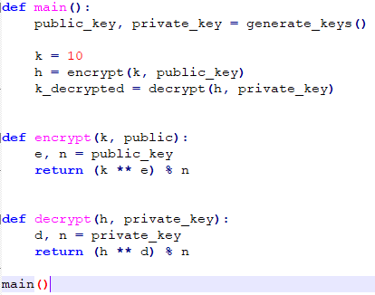

## 2. Modular Exponentiation

The problem with that implementation is that, even for very small exponents, 
the number k taken to e and the number h taken to d will both be far too large 
for the computer to handle efficiently. So to really implement the basic RSA 
algorithm we need to look at another algorithm called modular exponentiation.

To begin, every number can be broken into what is called its binary expansion. 
This is the sum of powers of two that add up to make the number (this process 
is used to translate decimal numbers into binary). Take 67 as an example:

Knowing our exponent rules, a number to an exponent times that same number to 
another exponent is that number to the sum of the exponents. This fact can also 
be used to break a number to an exponent into pieces. For example, take 5 to 
the power of 67.

Notice that we used this fact to break the exponent into its binary expansion.

Now say we wanted to take 5 to the power of 67 and reduce it mod 29. 5 is 5 to 
the first power. If we square it we get five squared. When this is reduced mod 
21 we find that 5 squared is congruent to 4 mod 29. If we squared 4, this is 
the same as squareing 5 squared, which is 5 to the fourth. Squared again and we 
get 5 to the eighth. Continuing on we get 5 to the power of a number that is 
itself a power of two. Using this process, we fill in the following table. See 
how this process is able to calculate very large exponents through only a 
little multiplication? (Infact, we will never deal with any number larger than 
the square of one less than the modulo number.)

Using this table we see that:

We also know that:

Plugging in our values we see that:

This whole algorithm is called modular exponentiation. Here is a snippet of 
code where we implement this algorithm. 

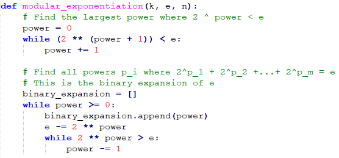

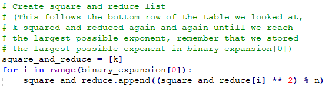

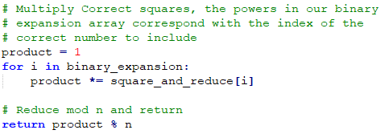

And now we simply tweek the basic algorithm by introducing this function call.

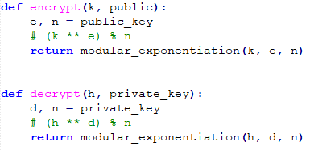

## 3. Basic Keys

Now we need to set up the keys for basic RSA. The process is shown in the image 
below. The steps are this.

 1. Choose two different prime numbers.
 2. Multiply them together to get our number n
 3. then use them to also find phi of n (more on this next section).
 4. Choose an exponent e that is relatively prime to phi of n.
 5. Find the inverse of e mod phi of n, this is our decryption exponent d
 6. Our keys are composed of e, d, and n.

While this is the process for creating the keys, it is not yet enough to 
understand what is going on or how to code it. In the next few sections we will 
cover:

 - what the phi function is
 - why e is 'undone' by d mod n
 - how the extended euclidean algorithm works and how it gives us our inverse

After this, we will understand basic RSA and will look at some code. But before 
we move on to those sections, we need to understand what the "trapdoor" is with 
RSA. By trapdoor, we mean the information that someone can encrypt without 
knowing, but must know in order to decrypt. Thus, while we know the trapdoor 
because we are the ones who created it, hackers need to search an obscenely 
large amount of time to find it. If found, the trapdoor will let people into 
our encrypted messages.

The trapdoor in RSA is the relationship between our primes, p and q, and the 
semiprime created by multiplying them together (n). It turns out that 
traditional computers and algorithms struggle immensely in breaking a large 
semiprime into its primes.

Notice that p and q are used to create phi of n. In turn, phi of n is used to 
create the decryption exponent d. The way we use the primes to do this is not 
something that can be extrapolated if we only know the semiprime. The 
encryption exponent uses the semiprime to encrypt, but unless it is found out 
how to break the semiprime into its primes, the decryption algorithm will not 
be found. This is the trapdoor of RSA.

## 4. Eulers Totient (The Phi Function)

The Phi function is also called Eulers Totient. I bring that up so you will 
recognize it by either name, but here I will call it the Phi function. The phi 
function confuses some people because it appears to come in different forms. We 
saw that phi of our semiprime was:

But later, when we cover the Chinese Remainder Theorem, we will use the fact 
that phi of a prime number is:

So what is the phi function and why does it seem to have different forms? These 
“different forms” turn out to all be specific results from the same general 
form. The phi function is defined to answer the following question: if I input 
a number n, how many numbers smaller than n are relatively prime to n?

Before we see the general function, remember that every number has a unique set 
of prime factors. A certain unique prime factor may be multiplied more than 
once in the creation of the number. To give an example of what I mean, take the 
number twelve:

See that the prime factors of 12 are 3, 2, and 2. But two shows up twice so we 
can write two to the power of 2. The unique prime factors are 3 and 2, and two 
shows up multiple times as is shown by its exponent. This final form can be 
generalized to the prime factorization of any number, and an be written as

Where each p is a unique prime factor and each a is the amount the respective 
prime factor shows up. Using this definition of the prime factorization of a 
natural number, the general form of the phi function is as follows (m is used 
to mean the amount of unique prime factors).

Where this formula comes from is beyond our scope here. The reason I bring it 
up here is so that we can derive the specific forms for semiprimes and for 
primes. Here is for semiprimes:

And here is for primes:

We have already used the semiprime form, and will later use the prime form. So 
this is what the function "is", by why is it important? That is the topic of 
the next section.

A simple implementation of the Euclidean Algorithm would be as follows. We will
not be using this, but will tweek it for the creation of the extended 
algorithm.

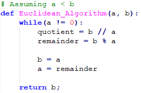

## 5. Proving that the Basic Keys Work

In the algorithm for basic RSA, we see that the decryption exponent d undoes 
what the encryption exponent e does. Also, n the section on creating the keys 
we said that d must be the inverse of e within the context of mod phi of n. Now 
we need to show that if d is created in this manner, then it trully will 'undo' 
e.

First, Euler proved a theorem that is now called Eulers Theorem. This theorem 
is as follow.

This states that any integer raised to the power of phi of n, then reduced mod 
n, will equal 1 (the proof for this is omitted here, but can be found on 
youtube). To further set up our proof that d undoes e, look at the following. 
We take the definition of d, multiply e to both sides, then subtract the one 
across. 

This says that ed-1 is 0 mod phi of n. That statment is equivalent to the 
statment that there exists some number m where m times phi of n equals ed-1.

With all of this set up, here is the proof. Notice that we use the previous 
equality to swap out the exponent to be in terms of phi of n, then we take 
advantage of Eulers Theorem. This is why phi of n is central to RSA.

## 6. The Euclidean Algorithm

We talked about the Phi function, we showed that d will undo e, now we need to 
actually compute the inverse of e mod phi of n. To do this we are going to use 
an algorithm known as the Extended Euclidean Algorithm. Before we get to the 
extended part, lets first look at just the basic Euclidean Algorithm.

The Euclidean Algorithm is meant to find the Greatest Common Divisor (gcd) 
between two numbers. If the gcd is 1, the two numbers are called relatively 
prime (also called coprime). The process starts by dividing the larger number  
by the smaller number and finding the remainder.

When dividing two numbers and finding a remainder, the process can be put in an 
equation. The equation states that if you have a dividend being divided by a 
divisor, then the dividend can be can be expressed as the divisor times the 
quotient, plus the remainder.

For example, if we divide 1158 by 873, we get a quotient of 1 with a remainder 
of 285. This can be written as:

Now say we had two numbers, a and b, where a is the larger of the two, and we 
wanted to find their GCD. First, we set up the equation as we saw before. Then 
we set up another division equation. This time we use the divisor of the 
previous equation as our dividend, and the previous remainder as the new 
divisor, then we find the new quotient and remainder. We repeat this process 
until we find a remainder of zero. The GCD is the last non-zero remainder, 𝑟_𝑛.

To see why the last non-zero remainder is the gcd, let’s first show that it is, 
in fact, a divisor. Notice that the last equation in the diagram (on the 
previous slide) shows that 𝑟_𝑛 divides 𝑟_(𝑛−1). Using this, look at the second 
to last equation. The right side is made up of a multiple of 𝑟_𝑛 and a multiple 
of 𝑟_(𝑛−1) added together. Because 𝑟_𝑛 divides both of these, it therefore 
divides the whole right side of the equation, which means it also divides the 
left side of the equation, which is just 𝑟_(𝑛−2). This exact line of reasoning 
can be repeated for the next equation and then the next, continuing until we 
find that 𝑟_𝑛 must divide a and b. Therefore, it is a common divisor.

But is it the greatest common divisor? Say we have another divisor, d. Looking 
at the first equation, say we subtract 𝑏(𝑞_1) across to the other side. The 
equation we get is:

Because d divides both a and b (because we assumed it was another common 
divisor), it must divide the left side and therefore also the right side, which 
is just 𝑟_1. If it divides 𝑟_1, then it must be true that 𝑑 ≤ 𝑟_1. We can use 
this result to do the exact same process on the next equation to conclude that 
𝑑 ≤ 𝑟_2. Continuing this down to the end, we find that 𝑑 ≤ 𝑟_𝑛. Therefore, the 
last remainder is not only a divisor, but is larger than or equal to any other 
arbitrary divisor. This shows it is the GCD.

Here is a quick example of using the Euclidean Algorithm to find that gcd⁡(1158, 
873)=3

## 7. The Extended Euclidean Algorithm

That was a thorough enough treatment on the basic Euclidean Algorithm, now for 
the extension. Say d is the gcd of a and b. There exists an r and an s such 
that:

The extension is about finding this equation (or rather, the extension is what 
found the existence of this equation, and once the importance of this equation 
was shown the extension became the method of finding this equation when 
necessary). To understand the importance of this, say we reduced both sides mod 
a. The left side is a divisor of a and is therefore smaller than a, it doesn’t 
reduce any further. But what happens to the right side? Obviously it reduces to 
d as that is what the equation says it equals, but is there any more 
information that can be gotten from that?

Consider the following. Because d is a divisor of a, it must be smaller so it 
reduces to itself. Then, because ra is a multiple of a, it reduces to zero.

This shows that s is a number that when multiplied by b and reduced mod a 
becomes the GCD. By symmetric reasoning, r will multiply by a and reduce mod b 
to become the GCD as well. What if the GCD is 1? First, let's state the 
property of r and s that we just found a little more explicitly.

If the GCD is 1 then this means:

So if the GCD is 1, then r and s are the inverses of a mod b and b mod a! See 
that this inverse only exists if the GCD is 1, meaning a and b must be 
relatively prime. This is why we needed gcd⁡(𝑒, 𝜑(𝑛))=1, that way we can find 
the decryption exponent d, the inverse of e mod phi of n.

So the equation 𝑑=𝑟𝑎+𝑠𝑏 is very important; it is how we find inverses between 
coprime numbers in modular arithmetic. The Extension of the Euclidean Algorithm 
is how we find this equation for any numbers a and b. So how does it work?

Take the basic Euclidean algorithm example done on the left. Cut off the last 
equation (after the line), reverse the order of the equations, then isolate the 
remainders on the left-hand side. You should get what you see on the right.

Further altering the series of equations we got in the previous slide, on the 
right-hand side explicitly give a coefficient of 1 in parenthesis for all 
numbers that don’t have coefficients. For the numbers that do have 
coefficients, move the negative into the coefficient. On the left I have the 
specific outcome for our example, on the right, I have a more general form. Now 
I want to make some observations.

The left-hand side of the top equation is the isolated gcd. The right hand side 
of the bottom equation is a multiple of _a_ plus a multiple of _b_. If we can 
find some way to "connect" these two together, we will have our equation. Now 
notice that every remainder on the left-hand side shows up in the equation of 
the next remainder. This could allow us to plug in the equation of a remainder 
into the equation of the next remainder, which is exactly what we will do.

Looking at the example equations we set up, look at the first two.

Now take the equation for 15 (the second equation) and plug it into 15 in the 
first equation. Then we simplify, but I will do it in a specific way to 
preserve the form and also make explicit a pattern that we will use to make an 
algorithm using matrices.

Now looking at our original series of equations replace the first two that we 
took out with the single equation that we just derived.

Now take the second equation and plug the remainder 18 into the 18 of the first 
equation and reduce (this is simply repeating the process we did before).

Again, replace the first two equations with the new one.

And repeat the process.

Now see that the last equation is the exact one we are looking for! The 
extension to Euclid's algorithm is to collapse the equations together to get 
one single equation, that’s it.

Hopefully you saw my little notes that said to rememver the specific equations 
that showed up in the process, now we are going to use them to create matrices. 
First, lets layout those forms in order.

Look at the two parenthesis. Let’s say the first parenthesis holds the first 
index of a vector and the second parenthesis holds the second index. The second 
equation then shows a transformation on the vector, and the third equation 
shows the new vector. A linear transformation on a vector can be symbolized as 
matrix vector multiplication.

What is the transformation that turns our first equation into that third 
equation? Notice that our first parenthesis (our vectors first index) has one 
times the second index of the initial vector, so the first row of our matrix is 
\[0  1]. The second parenthesis (second index) is the second index multiplied 
by -15 plus the first index. So our second row is \[1  -15]. We now have enough 
to write the following equation.

Now looking at the third equation (represented by our new vector) and the 
fourth equation (the next transformation to be represented by a matrix), we see 
the same pattern. The first index of the new vector is just the second index of 
the previous vector. The new second index is the old second index multiplied by 
some number (in this case -3) plus the old first index. This pattern will 
continue to the end so here is all the matrices to save time.

But where did -1, -3, -15, and -1 come from? Look at the equations we showed a 
little bit ago.

See how -1, -3, -15, and -1 are just −𝑞_1, −𝑞_2, −𝑞_3, and −𝑞_4? The whole 
matrix equation can be generalized as seen below.

Now look back at the final equation that the extended algorithm gave us in our 
example.

Notice that this can be written as the following dot product of the vector of 
_r_ and _s_ and a vector containing 1158 and 873 (example on left, general on 
right). This is neat just to see the final connection, but seeing as how we are 
really just looking for _r_ and _s_, our computation can stop after what was 
seen in the previous slide.

Now we are ready to put this into code. Take the following snippet:

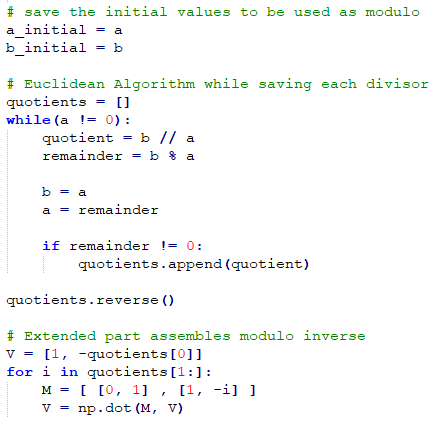

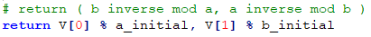

And now we are ready to create our keys for basic RSA.

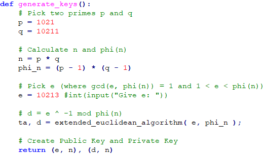

## 8. The Chinese Remainder Theorem

Now we are ready to add the chinese remainder theorem. First we will look
at the theorem itself in general, then we will see what it means for RSA.

The Chinese Remainder Theorem (CRT) is about answering the following type of 
question. If I have h mod a and k mod b, is there a number x that is congruent 
to both numbers? If so, what is it?

In fact, CRT asks this question for an arbitrary amount of numbers. We could 
add 'a j mod c, a g mod d and so on. However, for RSA we are going to look at 
just two numbers so we’ll keep it at that for now. A little bit of thought will 
show how all results can generalize to larger amounts of numbers. Let’s 
understand this question better by looking at an example.

Is there an x that is congruent to both of these? Let’s try to create such an 
x. Were going to try to create a number in two parts, the mod 5 part and the 
mod 4 part.

In the mod 5 section, I want a number that will reduce to 3, but I also don’t 
want it to interfere with the mod 4 section (and vice versa). To stop it from 
interfering with the mod 4 section, I could multiply everything in the mod 5 
section by 4. That way, when I reduce mod 4 it will reduce to zero. Likewise, I 
can put a five in the mod 4 section for a symmetric effect.

So now the question is whether there is a number I can multiply by 4 and reduce 
by 5 to get 3. Likewise, is there a number that multiplies by 5 and reduces by 
4 to get 2? A little guess and check will confirm the following numbers as 
valid (we will soon move beyond guess and check, don’t worry).

We now have a value for x, but is this the only answer? Say we multiplied 5 
times 4 together and get 20, what would happen if we added 20 to x? If we 
reduced it mod 5 this number we are adding reduces to zero and so doesn’t stop 
x from reducing to 3 mod 5. The same happens with mod 4. So adding 20, or any 
multiple of 20, will always return a valid value for x. All numbers that can be 
created such a way will reduce to a single value mod 20, so the complete answer 
can be stated as follow:

Let’s take it up a notch. Can I create a method to reconstruct x for any 
arbitrary number in mod 4 and any number mod 5? A method where I can always 
find x where 

Now I can’t do the guess and check like before (and good riddance), so this 
method needs to be far more algorithmically sound. First, lets start as we did 
before by placing 4 in a mod 5 section and 5 in a mod 4 section.

But now ask, what if I found a number that was the inverse of 4 mod 5 and 
multiplied it into the mod 5 section? By definition, the mod 5 section would 
reduce to one. The same could be done by putting the inverse of 5 mod 4 in the 
mod 4 section. Then, if I multiply h into the mod 5 section, x would reduce to 
h mod 5, whatever h is. Likewise with k in the mod 4 section.

So we need to find a number that is the inverse of 4 mod 5 and the inverse of 5 
mod 4. Thankfully, the extended Euclidean algorithm finds both of these at the 
same time! Doing the  work, we find that:

So x can be set up as follows.

Finally, remember that all possible x's are congruent to this x mod 5 times 4.

To take it up one more notch, lets now work with any generic modulus number, 
rather than 4 and 5. Going through the same logic that we have already done, 
you can see that if you want an x where 

Then x can be constructed as

Notice that that we can only find r and is if a and b are coprime, otherwise 
the inverses don’t exist. This is the general conclusion of CRT, that x exists 
if the modulo numbers are coprime and can be constructed according to the 
formula above.

Let’s now build up to why CRT can help us in RSA. First lets say we have the 
inverses of our primes (found using the extended Euclidean):

Now let’s say we have a number k mod n. Remember that n is the semiprime made 
of multiplying p and q together. We can break k into mod p and mod q and 
reassemble it using r and s.

Now let me define two functions. First is delta, it takes a number mod n and 
breaks it into an ordered pair.

Notice how delta does the ‘break apart’ process from CRT? Now define delta 
inverse. It takes in the ordered pair and puts out a number mod n.

This function clearly does the ‘stitching together’ process that we found in 
CRT. See how delta inverse undoes delta?

Now for some more symbols. The symbol on the left means “the set of integers 
mod n”, the symbol on the right means “the set of ordered pairs containing an 
integer mod p and an integer mod q”.

n this context, an arrow from one set to another means that the set is “mapped” 
to the set it points to. In other words, its elements are mapped to the 
elements of the other set. If a function is put above the arrow, it shows that 
the function is what is defining the mapping (there’s another way of notating 
this that is more common, but this way is more convenient for us for reasons 
that will make sense in a second). Using this notation, see that delta ‘maps’ 
from the set of integers mod n to the set of ordered pairs, and delta inverse 
maps in the opposite direction.

We are almost ready to tie this into RSA encryption, we just need one more 
important result from CRT. First, there is a rule in modular arithmetic that 
states: 

Using this rule, see if you can follow this:

It's messy, but the diagram shows that taking the exponent on the number and 
breaking it apart is the same as first breaking it apart and taking it to the 
exponent (the logic can be generalized to any positive whole number exponent, 
not just squaring).

## 9. RSA With CRT

The last section ended off by showing that CRT preserves exponents. So what if 
we defined a function that took an ordered pair of numbers each to the 
encrypting exponent? Take the following function E, the encrypting function.

(NOTE: To encrypt like this you need the primes to break apart the numbers, 
which defeats the point of RSA, but this thought exercise helps us move into he 
decryption with CRT process. So real world encryption will stay the same as it 
was in basic RSA, but we are going to develop a better way to decrypt.)

Now recall Eulers Theorem that stated:

And remember that phi of a prime can be shown to be the prime minus 1.

Say e was greater than p - 1. Define the following.

Putting this together, look at how we can reduce the size of an exponent mod p 
from e to our new exponent e1 by using Eulers Theorem.

Using all this, let's redefine our encryption function E to the following:

Encryption using CRT can then be shown using the following diagram 
(hypothetically of course, because this needs the primes it is a worthless 
algorithm, but decryption in CRT is the process of reversing this so it's here 
for the setup).

(NOTE: the arrow on the left is dotted because that is how the basic RSA 
algorithm would compute it. We don't actually compute that in CRT, but it's 
there to show that the end result with and without CRT is the same!)

So the question of decrypting with CRT is the same as asking what the inverse 
is of our E function. But that just means we need exponents, d1 and d2, that 
‘undo’ e1 and e2. Recognize that this is the same question as with basic RSA? 
We already proved the inverse of an encrypting exponent in mod phi of the 
modulo will give the decrypting exponent, so define the following:

See now that our decryption function can be defined as follows:

So the decryption algorithm using CRT can be shown in the diagram below. We 
take our encrypted number h, pass it into the Delta function, pass the ordered
pair into the decryption function, then pass that ordered pair into Delta 
Inverse. This gives the same answer as though we had taken h to the basic 
decryption exponent and reduced mod n.

So why would we want to use CRT to decrypt? Notice how we are operating in mod 
p and mod q, with exponents smaller than p-1 and q-1? This makes each operation 
significantly less costly, more than making up for the fact that we have to do 
each computation twice!

Now lets look at RSA with CRT over all. First let’s start with the setup, then 
we’ll look at the algorithm.

The public key remains the same as we are not using CRT to encrypt, but the 
private key is quite a bit more complex, along with the process of creating it. 
Now lets look at the algorithm. Remember, r and s can be found at the same time 
by plugging p and q into the extended Euclidean algorithm!

Let's put this into code. Here is a key generating function for RSA encryption
using the Chinese Remainder Theorem.

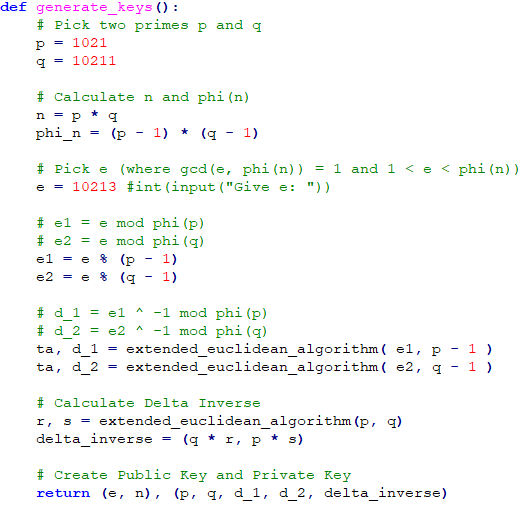

Now for the algorithm. The version on the left is the more verbose, the one on 
the right is the condensed version.

As complicated as it was to get here, the coding process is extremely simple, 
so lets look at some code.

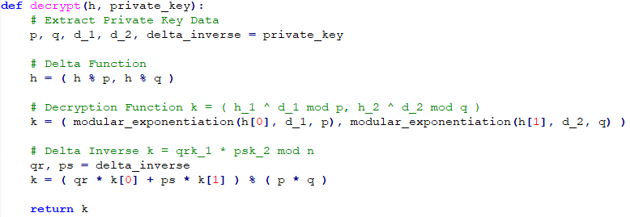
